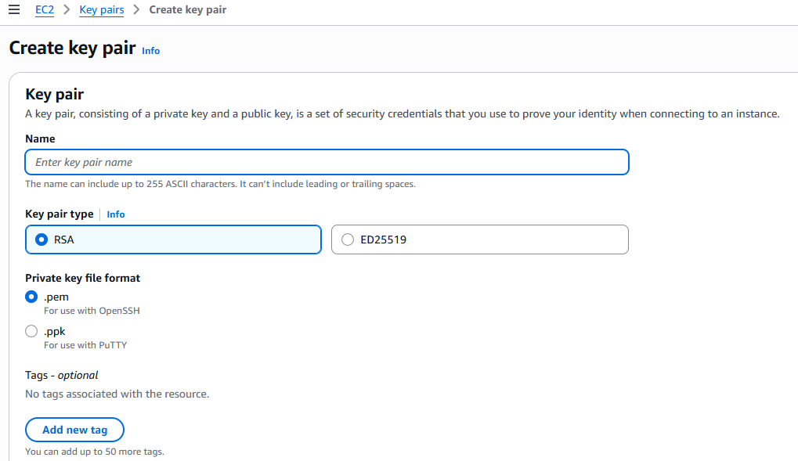

# AWS Service Catalog & CloudFormation Quick Start Guide
**Time to complete: ~45 minutes | Cost: Free tier**

## 🎯 What You'll Learn

By the end of this guide, you'll understand:
- **CloudFormation**: Infrastructure as Code (IaC) - define AWS resources in templates
- **Service Catalog**: Self-service portal for approved CloudFormation templates
- **How they fit together**: Service Catalog wraps CloudFormation templates for governance

## 📚 The Big Picture

```
┌─────────────────────────────────────────────────────────┐
│                    AWS Service Catalog                   │
│  (Self-service portal for end users)                    │
│                                                          │
│  ┌────────────┐  ┌────────────┐  ┌────────────┐       │
│  │ Product A  │  │ Product B  │  │ Product C  │       │
│  │ (Web App)  │  │ (Database) │  │ (S3 Bucket)│       │
│  └─────┬──────┘  └─────┬──────┘  └─────┬──────┘       │
│        │                │                │              │
│        └────────────────┴────────────────┘              │
│                         │                               │
└─────────────────────────┼───────────────────────────────┘
                          │
                          ▼
            ┌──────────────────────────┐
            │   CloudFormation Stack   │
            │  (Actual AWS resources)  │
            │                          │
            │  - EC2 instance          │
            │  - Security group        │
            │  - S3 bucket             │
            │  - RDS database          │
            └──────────────────────────┘
```

### Key Concepts

1. **CloudFormation Template** (`.yaml` or `.json`)
   - Blueprint defining AWS resources
   - Version-controlled infrastructure code
   - Repeatable and predictable deployments

2. **CloudFormation Stack**
   - Running instance of a template
   - Manages lifecycle (create, update, delete)
   - Resources created/destroyed as a unit

3. **Service Catalog Product**
   - CloudFormation template + metadata
   - Controls who can launch what
   - Adds governance layer (constraints, version control)

4. **Service Catalog Portfolio**
   - Collection of products
   - Access control (who can see/launch products)
   - Think: "App catalog" for your organization

## 🚀 Hands-On Labs (45 minutes)

### Lab 1: CloudFormation Basics (15 min)
**Goal:** Create an S3 bucket using CloudFormation

1. **Create your first template:**
   ```bash
   # File already created: lab1-simple-s3.yaml
   ```

2. **Deploy via AWS Console:**
   - Go to: https://console.aws.amazon.com/cloudformation
   - Click **Create stack** → **With new resources**
   - Choose **Upload a template file**
   - Upload `lab1-simple-s3.yaml`
   - Stack name: `my-first-stack`
   - BucketName parameter: `my-unique-bucket-20260318` (must be globally unique!)
   - Click **Next** → **Next** → **Submit**

3. **Watch it create:**
   - Events tab shows progress
   - Resources tab shows what was created
   - Outputs tab shows bucket URL

4. **Clean up:**
   - Select stack → **Delete**
   - Confirms resources are deleted (no orphaned resources!)

**Key takeaway:** CloudFormation manages resources as a unit. Delete stack = delete everything.

---

### Lab 2: Multi-Resource Stack (15 min)
**Goal:** Deploy EC2 instance with proper networking

1. **Review template:**
   ```bash
   # File: lab2-ec2-with-vpc.yaml
   # Creates: VPC, Subnet, Security Group, EC2 instance
   ```

2. **Deploy:**
   - CloudFormation console → **Create stack**
   - Upload `lab2-ec2-with-vpc.yaml`
   - Stack name: `web-server-stack`
   - KeyName: Select your EC2 key pair (create one first if needed!)
   
   - InstanceType: `t2.micro` (free tier)
   - Click through → **Submit**

3. **Explore:**
   - Check **Resources** tab - see all created resources
   - Check **Outputs** tab - see public IP
   - Try SSH: `ssh -i your-key.pem ec2-user@<PublicIP>`

4. **Update the stack:**
   - Select stack → **Update**
   - Replace template with `lab2-ec2-with-vpc.yaml` (same file)
   - Change InstanceType to `t3.micro`
   - CloudFormation will replace the instance!

5. **Clean up:**
   - Delete stack when done

**Key takeaway:** CloudFormation handles dependencies automatically (VPC before Subnet, etc.)

---

### Lab 3: Service Catalog Setup (15 min)
**Goal:** Create a self-service catalog for S3 buckets

#### Step 1: Create Portfolio (5 min)

1. **Go to Service Catalog:**
   - https://console.aws.amazon.com/servicecatalog

2. **Create Portfolio:**
   - Click **Portfolios** → **Create portfolio**
   - Name: `Development Resources`
   - Description: `Self-service resources for dev team`
   - Owner: Your email
   - Click **Create**

3. **Grant Access:**
   - Select portfolio → **Groups, roles, and users** tab
   - Click **Add groups, roles, users**
   - Add yourself (or create an IAM user for testing)

#### Step 2: Create Product (5 min)

1. **Upload template to S3:**
   ```bash
   # First, create a bucket for templates:
   # Go to S3 console, create bucket: service-catalog-templates-<your-name>
   # Upload lab1-simple-s3.yaml to this bucket
   # Copy the S3 URL
   ```

2. **Create Product:**
   - Portfolios → Select `Development Resources`
   - Click **Create product**
   - Product name: `Secure S3 Bucket`
   - Description: `Pre-configured S3 bucket with encryption`
   - Owner: Your email
   - Distributor: `IT Operations`

3. **Version details:**
   - Version title: `v1.0`
   - Description: `Initial release`
   - CloudFormation template: Paste S3 URL from step 1
   - Click **Create product**

#### Step 3: Launch Product (5 min)

1. **Switch to end-user view:**
   - Service Catalog → **Products**
   - You'll see `Secure S3 Bucket`

2. **Launch:**
   - Click product → **Launch product**
   - Name: `my-dev-bucket`
   - BucketName: `dev-bucket-yourname-20260318`
   - Click **Launch**

3. **Observe:**
   - This creates a CloudFormation stack behind the scenes!
   - Service Catalog → **Provisioned products** → See your bucket
   - CloudFormation console → See the stack it created

4. **Terminate:**
   - Provisioned products → Select → **Terminate**

**Key takeaway:** Service Catalog provides a simplified UI for CloudFormation. Users don't need CloudFormation permissions!

---

## 🎓 Key Differences

| Feature | CloudFormation | Service Catalog |
|---------|---------------|-----------------|
| **Users** | Admins, DevOps | End users (developers, teams) |
| **Permissions** | Needs broad IAM permissions | Users only need `servicecatalog:*` |
| **Interface** | Technical (JSON/YAML) | Simplified form-based UI |
| **Governance** | Manual | Built-in (constraints, approvals) |
| **Use case** | Direct infrastructure deployment | Self-service for approved resources |

## 🔧 Common Use Cases

### CloudFormation Direct:
- CI/CD pipelines deploying infrastructure
- Admin provisioning complex environments
- Disaster recovery (redeploy entire stack)

### Service Catalog:
- Developers launching approved dev environments
- Data scientists requesting GPU instances
- Teams creating standardized S3 buckets
- Compliance-required resource templates

## 💡 Best Practices

1. **Start with CloudFormation** - understand templates first
2. **Template everything** - if you click it in console, you should template it
3. **Use parameters** - make templates reusable
4. **Version control** - treat templates like code (Git!)
5. **Service Catalog for scale** - when you need to empower others

## 🚨 Free Tier Notes

All labs use free tier eligible resources:
- ✅ S3 buckets (first 5GB free)
- ✅ t2.micro/t3.micro EC2 (750 hours/month free)
- ✅ CloudFormation (no charge)
- ✅ Service Catalog (no charge)

**Remember to delete stacks when done!**

## 📖 Next Steps

After this guide:
1. **CloudFormation deep dive:**
   - Explore: https://docs.aws.amazon.com/cloudformation/
   - Try: Nested stacks, StackSets, Change Sets

2. **Service Catalog advanced:**
   - Add constraints (launch constraints, tag update constraints)
   - Create multi-account catalogs (with Organizations)
   - Add approval workflows

3. **Real-world templates:**
   - Browse AWS Quick Starts: https://aws.amazon.com/quickstart/
   - Explore CloudFormation registry for third-party resources

## 🆘 Troubleshooting

**Stack stuck in CREATE_IN_PROGRESS:**
- Check Events tab for errors
- Common: IAM permissions, resource limits, name conflicts

**Service Catalog product won't launch:**
- Check IAM permissions (user needs `servicecatalog:ProvisionProduct`)
- Verify S3 template URL is accessible
- Check portfolio access grants

**Can't delete stack:**
- Resources may have dependencies (e.g., S3 bucket not empty)
- Manually remove dependencies or use `DeletionPolicy: Retain`

## 📁 Files in This Guide

- `lab1-simple-s3.yaml` - Simple S3 bucket template
- `lab2-ec2-with-vpc.yaml` - Multi-resource web server
- `lab3-rds-database.yaml` - (Bonus) RDS database template
- `cheatsheet.md` - Quick reference commands

---

**Ready?** Start with Lab 1! 🚀
