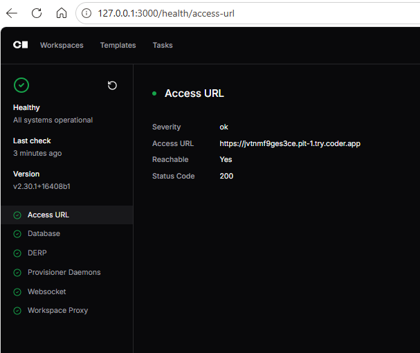
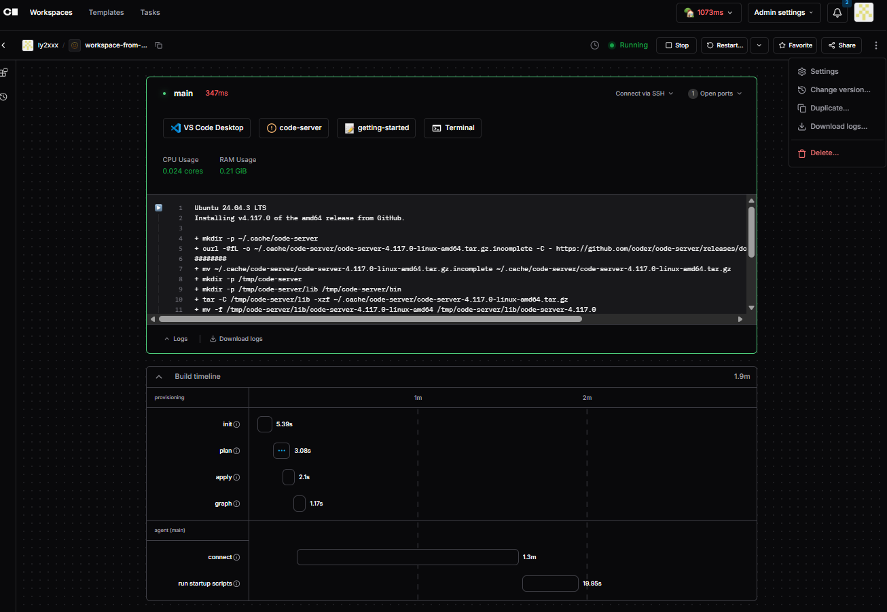

# Coder Workspace Component Architecture

This document explains the relationship between the five core Coder Terraform provider components visible in a running workspace, illustrated by the `terraform test --verbose` output from Exercise 7.

## Components in a Running Workspace

```
┌─────────────────────────────────────────────────────────────┐
│                    CODER CONTROL PLANE                      │
│                                                             │
│  data.coder_workspace.me      data.coder_workspace_owner.me │
│  ─────────────────────────    ──────────────────────────── │
│  name, id, transition,        name, email, ssh keys,        │
│  template info, start_count   session_token, oidc_token     │
│          │                              │                   │
│          └──────────────┬───────────────┘                   │
│                         │ read-only context                 │
└─────────────────────────┼───────────────────────────────────┘
                          │ informs provisioning (startup_script, env vars)
                          ▼
┌─────────────────────────────────────────────────────────────┐
│               COMPUTE RESOURCE (VM / Container)             │
│                                                             │
│   coder_agent.main                                          │
│   ├── .init_script  → injected as container entrypoint      │
│   ├── .token        → set as CODER_AGENT_TOKEN env var      │
│   └── .id           ──────────────────────────┐            │
│                                               │ agent_id   │
│                          coder_app.code_server ◄────────────┤
│                          url: http://localhost:8080          │
│                          healthcheck: /health               │
│                                               │ agent_id   │
│                          coder_app.terminal   ◄────────────┘│
│                          url: ws://localhost:8080/terminal  │
└─────────────────────────────────────────────────────────────┘
```

## Component Reference

### `data.coder_workspace`
**Role:** Read-only context about the active workspace build.

Key attributes used in templates:
- `name` — workspace name (e.g. for labelling containers)
- `id` — workspace UUID
- `transition` — `"start"` or `"stop"`, drives `count = data.coder_workspace.me.start_count` to create/destroy compute resources
- `start_count` — `1` when starting, `0` when stopping; the standard pattern for conditional resource creation
- `template_id`, `template_name`, `template_version` — template metadata

Official doc: https://github.com/coder/terraform-provider-coder/blob/main/docs/data-sources/workspace.md

---

### `data.coder_workspace_owner`
**Role:** Read-only context about the user who owns the workspace.

Key attributes used in templates:
- `name`, `email`, `full_name` — used to personalise env vars (e.g. `GIT_AUTHOR_EMAIL`)
- `ssh_public_key`, `ssh_private_key` — injected for git/SSH workflows
- `session_token` — regenerated each workspace start; used for Coder CLI auth inside the workspace
- `oidc_access_token` — for SSO-integrated tooling

Official doc: https://github.com/coder/terraform-provider-coder/blob/main/docs/data-sources/workspace_owner.md

---

### `coder_agent`
**Role:** The process that runs *inside* the compute resource and phones home to the Coder control plane. It is the connective tissue that makes a workspace "connected".

How it wires up:
1. Terraform provisions the compute resource (Docker container, VM, pod)
2. `coder_agent.main.init_script` is injected as the container's startup command
3. `coder_agent.main.token` is set as the `CODER_AGENT_TOKEN` environment variable
4. The agent process starts, authenticates with the token, and the workspace status changes to **Connected**
5. `coder_agent.main.id` is then referenced by every `coder_app` via `agent_id`

Key attributes:
- `os`, `arch` — required; describes the compute environment
- `id` — referenced by all `coder_app` resources
- `token` — sensitive; authenticates the agent to the control plane
- `init_script` — generated bootstrap script to inject into compute
- `startup_script` — runs after agent connects (install tools, configure env)

Official doc: https://github.com/coder/terraform-provider-coder/blob/main/docs/resources/agent.md

---

### `coder_app` (e.g. `code_server`, `terminal`)
**Role:** Shortcuts displayed in the Coder dashboard that proxy traffic to services running inside the workspace.

Both apps share the same resource type; the difference is the URL scheme:

| App | URL scheme | Notes |
|-----|-----------|-------|
| `code_server` | `http://` | Web IDE; has a `healthcheck` block so Coder waits until the app is ready |
| `terminal` | `ws://` | WebSocket terminal; no healthcheck needed |

Key attributes:
- `agent_id` — **required**; must reference `coder_agent.main.id` — apps cannot exist without an agent
- `slug` — URL-safe identifier, unique per agent
- `url` — proxied endpoint (always `localhost` from the agent's perspective)
- `healthcheck` — optional HTTP readiness probe (`interval`, `threshold`, `url`)

Official doc: https://github.com/coder/terraform-provider-coder/blob/main/docs/resources/app.md

---

## Dependency Chain Summary

```
data.coder_workspace         ─┐
                              ├─► content of coder_agent.startup_script
data.coder_workspace_owner   ─┘   and environment variables

coder_agent.main  (must exist first)
    └── .id ──► coder_app.code_server (agent_id)  [http, healthcheck]
    └── .id ──► coder_app.terminal   (agent_id)  [websocket]
```

The two **data sources** are pure context — they carry no Terraform state and create no infrastructure.  
The **agent** is the single mandatory bridge between the Coder control plane and the compute resource.  
**Apps** are optional UI shortcuts that cannot be declared without a live agent ID.



---

## Docker vs Kubernetes: Inspecting a Running Workspace

When a Coder workspace runs locally in **Docker**, the compute resource is a container.  
When it runs on **AWS EKS / Kubernetes**, the compute resource is a **Pod**.  
The agent mechanism is identical — only the inspection commands differ.

### Command equivalents

| Purpose | Docker (local) | Kubernetes (AWS EKS) |
|---|---|---|
| List workspaces | `docker ps` | `kubectl get pods -n coder` |
| Inspect config / env | `docker inspect <container>` | `kubectl describe pod <pod> -n coder` |
| Shell into workspace | `docker exec -it <container> sh` | `kubectl exec -it <pod> -n coder -- sh` |
| View logs | `docker logs <container>` | `kubectl logs <pod> -n coder` |

### Docker examples (local)

```sh
# Inspect the container (env vars, entrypoint, volumes)
docker inspect coder-ly2xxx-workspace-from-build-template00

# Shell in and check PID 1 (confirms ./coder agent is running)
docker exec -it coder-ly2xxx-workspace-from-build-template00 sh -c "cat /proc/1/cmdline | tr '\0' '\n'"

# Find the downloaded agent binary
docker exec -it coder-ly2xxx-workspace-from-build-template00 find /tmp -name coder -type f
```

### Kubernetes examples (AWS EKS)

```sh
# Find the workspace pod
kubectl get pods -n coder

# Inspect it (equivalent to docker inspect)
kubectl describe pod <pod-name> -n coder

# Shell into the workspace pod
kubectl exec -it <pod-name> -n coder -- sh

# Inside the pod: confirm PID 1 is the coder agent
cat /proc/1/cmdline | tr '\0' '\n'

# Inside the pod: find the agent binary in /tmp
find /tmp -name coder -type f

# View logs (including previous run if pod restarted)
kubectl logs <pod-name> -n coder
kubectl logs <pod-name> -n coder --previous
```

### Key difference

On Kubernetes the Terraform template uses `kubernetes_pod` instead of `docker_container`, but the `coder_agent` init_script, token, and `CODER_AGENT_URL` are **identical** — only the infrastructure resource type changes.

### Other useful commands
```sh
docker exec -it coder-ly2xxx-workspace-from-build-template00 sh

docker exec -it coder-ly2xxx-workspace-from-build-template00 sh -c "cat /proc/1/cmdline | tr '\0' '\n'"
```

# Inside the container — find and start code-server:
/tmp/code-server/bin/code-server --bind-addr 0.0.0.0:8080 &

# Then test the healthcheck:
curl -v http://localhost:8080/health
