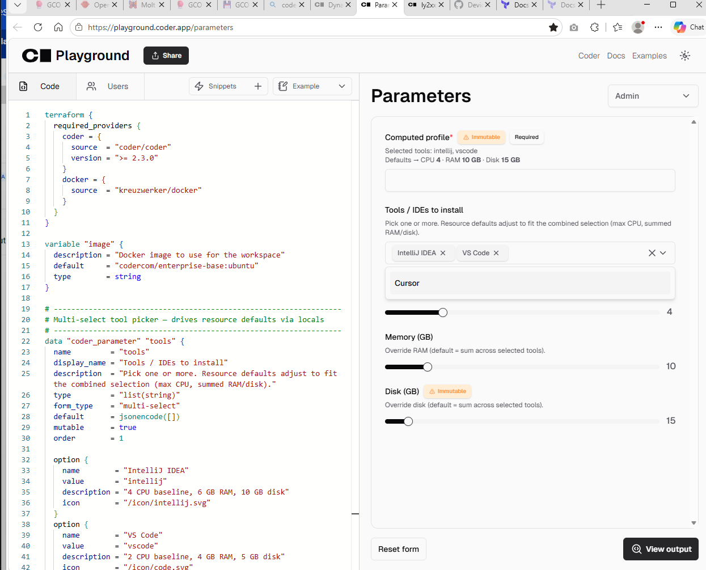

# Lab: Tool-Based Resource Defaulting

Goal: pick a tool (IntelliJ / VS Code / None) and have CPU, RAM, and DISK
defaults change to match — without stopping the user from overriding.

| Tool          | CPU | RAM  | DISK |
| ------------- | --- | ---- | ---- |
| None          | 2   | 2 GB | 2 GB |
| VS Code       | 2   | 4 GB | 5 GB |
| IntelliJ IDEA | 4   | 6 GB | 10 GB |

## How it works

Three techniques, layered:

1. **Locals map (`local.tool_profiles`)** — single source of truth for each
   tool's resource shape. Lookup by the `tool` parameter value.
2. **Dynamic parameter defaults** — `cpu` / `memory` / `disk` parameters
   set `default = local.profile.cpu` etc. Coder re-evaluates these defaults
   in the workspace creation form when the user changes the `tool` dropdown
   (Coder ≥ 2.19, dynamic parameters GA).
3. **Workspace presets** — three `coder_workspace_preset` blocks so a user
   can one-click "IntelliJ", "VS Code", or "Minimal" instead of fiddling.

`disk` is marked `mutable = false` because resizing a workspace volume after
creation is non-trivial — change it by recreating, or by switching presets.

## Prerequisites

- Local Coder running (you already have this).
- Docker available to the Coder provisioner.
- Coder CLI authenticated: `coder login <your-url>`.

## Push the template

From this directory:

```bash
# First-time create
coder templates push tool-based-resources -d . -y

# Subsequent updates
coder templates push tool-based-resources -d . -y --activate
```

## Try it

```bash
# Interactive — pick the tool from the dropdown, watch CPU/RAM/DISK defaults change
coder create my-ws --template tool-based-resources

# Use a preset (no prompts)
coder create ij-ws --template tool-based-resources --preset "IntelliJ (4 CPU / 6 GB / 10 GB)" -y

# Override the defaults explicitly
coder create custom-ws --template tool-based-resources \
  --parameter tool=intellij \
  --parameter cpu=8 \
  --parameter memory=12 \
  --parameter disk=20 -y
```

## Verify the allocation

```bash
# See the chosen profile in template output
coder show my-ws

# Confirm Docker actually applied the limits
docker inspect coder-<owner>-my-ws \
  --format 'cpu_shares={{.HostConfig.CpuShares}} mem={{.HostConfig.Memory}} storage_opt={{.HostConfig.StorageOpt}}'
```

You should see `cpu_shares` = `cpu * 1024` and `mem` = `memory_gb * 1024 * 1024 * 1024`
(actually `memory * 1024` MB in our config — adjust units in `main.tf` if you
prefer GB-precise values).

## Caveats

- **Docker Desktop disk limits**: `storage_opt.size` is only enforced when the
  daemon's storage driver is `overlay2` on `xfs` (with `pquota`) or `btrfs`.
  On Windows/Mac Docker Desktop it's accepted but not enforced. For real disk
  quotas, run on Linux with the right backing FS, or move to Kubernetes where
  `disk_size_gb` on a PVC is enforced.
- **Dynamic param re-evaluation**: if you've disabled dynamic parameters in
  your Coder deployment (`CODER_EXPERIMENTS=-dynamic-parameters` or older
  versions), `default = local.profile.cpu` is computed once and the user must
  use presets instead. Check with `coder server experiments list`.
- **Mutability**: `cpu` and `memory` are `mutable = true` so existing
  workspaces can be resized via "Update workspace". `disk` is immutable —
  changing it for an existing workspace requires recreate.

## Extending

- Add more tools (PyCharm, GoLand, Cursor) by adding entries to
  `local.tool_profiles` and a matching `option {}` block on `tool`.
- Per-team org defaults: replace the static map with values from a
  `data "http"` call to an internal config service.
- Cost guardrails: add a `validation { min/max }` that varies by group using
  `data.coder_workspace_owner.me.groups`.

## Files

- [main.tf](main.tf) — template definition (parameters, locals, presets, container).
- [README.md](README.md) — this file.

Lab created at [coder-templates/tool-based-resources](coder-templates/tool-based-resources/).

**The approach** (three layers, pick what fits):

1. **`local.tool_profiles` map** — one source of truth keyed by tool name (`none` / `vscode` / `intellij`) holding `{cpu, memory, disk}`.
2. **Dynamic parameter defaults** — `cpu`/`memory`/`disk` parameters set `default = local.profile.cpu` etc., so when the user changes the **Tool** dropdown the resource defaults re-evaluate live (Coder ≥ 2.19). User can still type-override.
3. **Workspace presets** — three one-click presets (`IntelliJ`, `VS Code`, `Minimal`) for users who don't want to think.

**Try it:**
```bash
coder login http://localhost:3000   # or whatever URL your local Coder runs on
coder whoami                        # confirm
cd C:/code/DevOps-labs/coder-templates/tool-based-resources
coder templates push tool-based-resources -d . -y
coder create ij-ws --template tool-based-resources --preset "IntelliJ (4 CPU / 6 GB / 10 GB)" -y
```

**Two gotchas worth knowing before you push:**
- `storage_opt.size` is advisory on Docker Desktop (Win/Mac) — only enforced on Linux + overlay2/xfs-pquota or btrfs. On K8s you'd use `disk_size_gb` on a PVC instead.
- Dynamic-parameter live-recompute requires the feature enabled in your Coder deployment (GA in 2.19+). If yours is older, the presets path still works.

See [main.tf](coder-templates/tool-based-resources/main.tf) and [README.md](coder-templates/tool-based-resources/README.md) for the full lab. Want me to adapt this to a Kubernetes provider so the disk quota is actually enforced?

